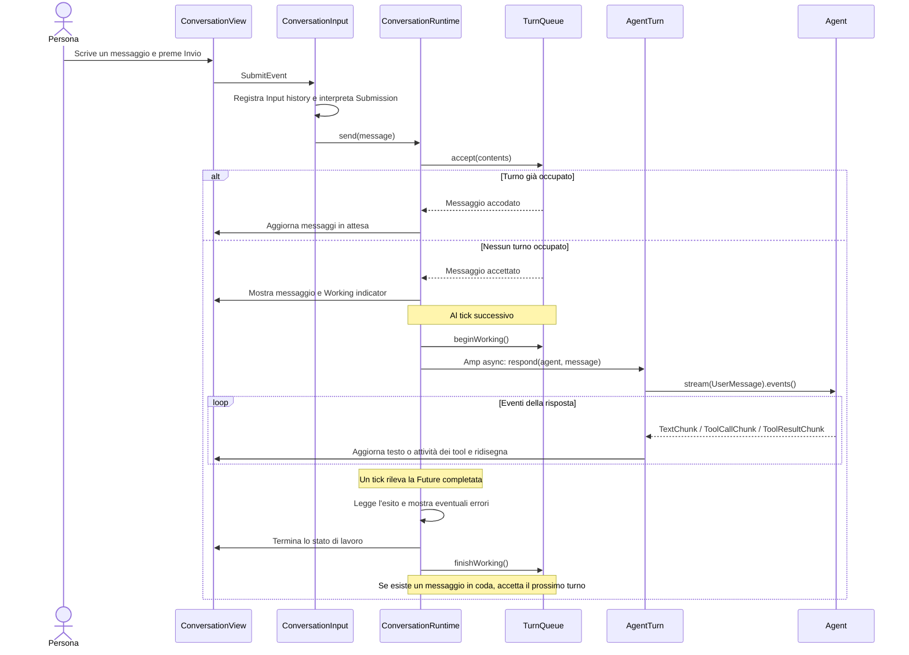
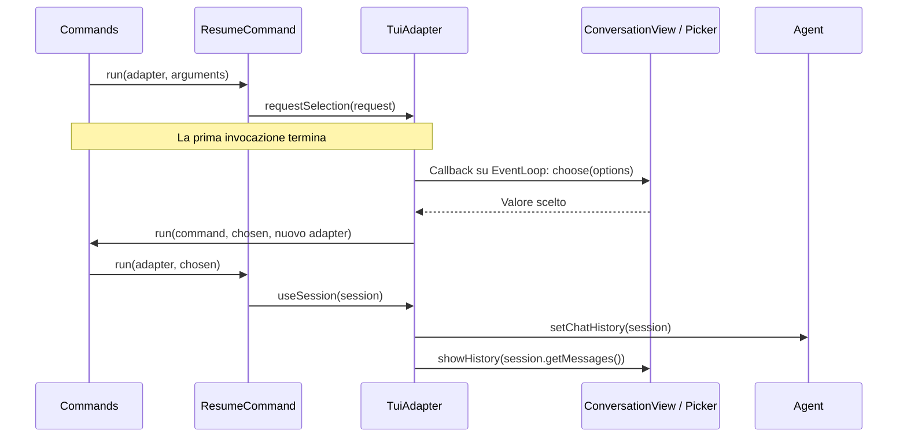

# Conversation: input, turni e comandi

[Indice dell’architettura](README.md)

Il modulo [src/Conversation](../../src/Conversation) collega gli input della
persona all’Agent e ai Commands. Mantiene l’Agent corrente, lo stato dei turni
e la coda dei messaggi, e traduce i controlli dei comandi in effetti della TUI.

## Componenti

| Componente | Responsabilità |
| --- | --- |
| [ConversationInput](../../src/Conversation/ConversationInput.php) | Invii, registrazione degli input, richiamo, modifica della bozza e scorciatoie. |
| [Submission](../../src/Conversation/Submission.php) | Interpreta l’input come CommandInput oppure MessageForAgent. |
| [ConversationRuntime](../../src/Conversation/ConversationRuntime.php) | Agent corrente, avvio e conclusione dei turni, Future ed errori. |
| [TurnQueue](../../src/Conversation/TurnQueue.php) | Stati del turno e ordine dei messaggi in attesa, senza dipendenze da vista o provider. |
| [AgentTurn](../../src/Conversation/AgentTurn.php) | Consuma gli eventi dell’Agent e aggiorna la vista durante la risposta. |
| [TuiAdapter](../../src/Conversation/TuiAdapter.php) | Realizza CommandAdapterInterface nel terminale. |
| [ConcurrentCommands](../../src/Conversation/ConcurrentCommands.php) | Decide quali comandi ammettere durante un turno. |

## Percorso di un messaggio

Un turno occupa la conversazione già nello stato `Accepted`: anche un secondo
messaggio arrivato prima dell'avvio effettivo della risposta entra in coda.
L'Agent viene catturato quando il turno parte; quel turno termina con lo stesso
Agent. La coda è FIFO e il runtime esegue un turno alla volta.

Amp gestisce la Future della risposta nello stesso processo. La reattività
dipende dalla cooperazione delle operazioni eseguite: un tool con I/O bloccante
può fermare anche il loop del terminale. La
[ricerca sui tool non bloccanti](../research/neuron-non-blocking-tools.md)
approfondisce questo limite e riporta le versioni esaminate.

## Percorso di un Command

Un input che inizia con `/` viene separato in nome e `CommandArguments`.
`ConversationInput` passa questi valori a `Commands::run()` insieme a un nuovo
TuiAdapter. Commands coordina ricerca, ammissione, esecuzione e completamento.

Il comando usa i controlli dell'Adapter per produrre effetti: `say()`, `warn()`,
`promptAgent()`, `requestSelection()`, `useAgent()`, `useSession()` o `stop()`.
L'esito tecnico viene interpretato da `afterExecution()`, che mostra comandi
sconosciuti ed errori. Il completamento dell'invocazione può precedere quello
di una selezione o di una risposta dell'Agent.

Durante un turno, la policy [ConcurrentCommands](../../src/Conversation/ConcurrentCommands.php)
ammette soltanto le istanze di `HelpCommand` e `LeaveCommand`. Gli altri comandi
vengono rifiutati con un avviso; i messaggi ordinari entrano invece in coda.

Una selezione, come quella richiesta da ResumeCommand, avviene in due passaggi:

La richiesta porta opzioni e nome del comando da richiamare. Il Picker raccoglie
la scelta; se la persona annulla, non viene eseguita la seconda invocazione.
Le Command suggestions aiutano invece a completare il nome di un comando nel
composer e non sospendono un'invocazione.

## Cambio Agent ed errori

`ConversationRuntime::useAgent()` trasferisce la History corrente all’Agent
che subentra. Il turno già avviato continua con l’Agent catturato alla partenza;
i turni successivi usano quello corrente. `TuiAdapter::useSession()` installa
invece una Session come History e chiede alla vista di ricostruire la conversazione.

Quando la Future termina, Runtime ne legge l’esito. Le eccezioni vengono
mostrate nella vista e il turno viene chiuso, consentendo di passare al
messaggio successivo. Le interruzioni Human-in-the-loop ricevono un messaggio
esplicito di funzionalità non supportata. AgentTurn segnala anche una risposta
priva sia di testo visualizzabile sia di attività dei tool.

## Input history e tastiera

ConversationInput ignora invii vuoti e registra gli altri input prima del
dispatch. InputHistory comprime duplicati esatti consecutivi; i prompt creati
da un comando attraverso `promptAgent()` non vengono registrati come input
digitati. Il richiamo parte dal composer vuoto; modificare una bozza richiamata
abbandona la navigazione. Picker e Command suggestions hanno precedenza sui
tasti di navigazione quando le rispettive liste sono attive.

Per rendering e selezioni vedere [View](View.md); per la distinzione tra
History, Session e Input history vedere [History](History.md).
