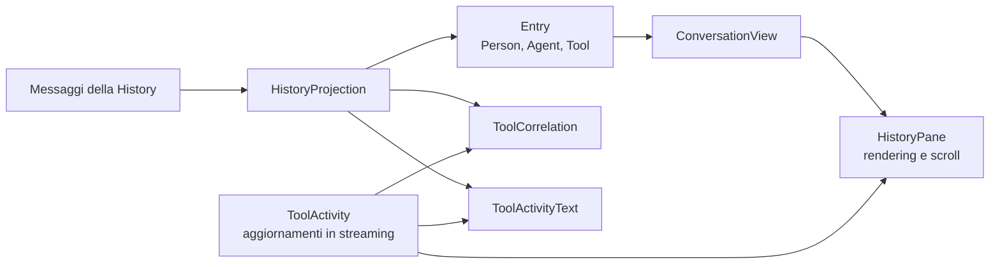

# History: proiezione della conversazione

[Indice dell’architettura](README.md)

Il modulo [src/History](../../src/History) definisce come i messaggi dell’Agent
diventano elementi visualizzabili. La History dell’Agent e la persistenza
delle Session appartengono rispettivamente a Neuron AI e Neuron Interaction;
questo modulo si occupa della loro rappresentazione nella Conversation TUI.

## Proiezione e rendering

[HistoryProjection](../../src/History/HistoryProjection.php) costruisce uno
snapshot a partire da un array di messaggi. Ogni
[Entry](../../src/History/Entry.php) contiene il tipo definito da
[EntryKind](../../src/History/EntryKind.php) e il testo da rappresentare.
La costruzione avviene all’avvio e al cambio Session; durante lo streaming
AgentTurn aggiorna direttamente la vista.

## Regole di rappresentazione

- La proiezione prende in considerazione i messaggi con ruolo user o assistant.
- I blocchi di testo conservano il contenuto; quelli di reasoning vengono omessi.
- Immagini, audio e video diventano segnaposto, ad esempio `[Image]`.
- I file diventano `[File]` oppure un segnaposto con il nome del file ripulito,
  senza il percorso e con una larghezza limitata.
- I contenuti vuoti non generano un elemento parlato.
- Chiamate e risultati dei tool vengono associati per aggiornare l’attività
  corrispondente nella sequenza mostrata.

## Correlazione dei tool

[ToolCorrelation](../../src/History/ToolCorrelation.php) ricorda dove è stata
mostrata ciascuna chiamata. Quando è disponibile, usa il call ID per trovare
la chiamata esatta anche se i risultati arrivano in ordine diverso. In assenza
di call ID usa il nome del tool e l’ordine FIFO delle chiamate senza ID con
quel nome. Se non trova corrispondenza, restituisce `null`.

HistoryProjection e ToolActivity gestiscono un risultato senza chiamata
corrispondente creando un elemento e completandolo subito.
[ToolActivityText](../../src/History/ToolActivityText.php) costruisce il testo
per attività pendenti e completate, condiviso dai due percorsi.

La proiezione usa una durata pari a zero per le attività lette dai messaggi,
che non portano le misure temporali della vista. ToolActivity misura invece
il tempo trascorso durante la risposta in corso.

## Stato e persistenza

| Stato | Dove risiede | Significato |
| --- | --- | --- |
| History | Nell'Agent, tramite la Chat History installata | Messaggi che costituiscono il contesto della conversazione. Può avere una persistenza indipendente da SessionStore. |
| Session | In Neuron Interaction, gestita da SessionStore | Conversazione di un utente con chiave e metadati, installabile direttamente come Chat History dell'Agent. |
| Input history | In InputHistory, sullo Storage configurato | Input digitati, inclusi i comandi, richiamabili tra Session e Adapter. Il cursore di navigazione e la bozza appartengono all'istanza InputHistory. |
| Stato dei turni | In TurnQueue e ConversationRuntime | Turno accettato o attivo, messaggi in attesa e Future della risposta. |
| Stato visivo | In ConversationView e nei componenti View | Testo in composizione, selezioni, elementi mostrati e indicatore di lavoro. |

All'avvio la TUI mostra la History che l'Agent possiede già: non la importa in
SessionStore e non riprende automaticamente una Session. Per rendere gestita la
conversazione iniziale, la Host Application installa una Session creata o letta
dal proprio Store prima di chiamare `run()`.

Cambiare Session significa sostituire la Chat History dell'Agent e ricostruire
la vista. `HistoryProjection` seleziona i contenuti visualizzabili, rappresenta
i contenuti multimediali con segnaposto e associa i risultati dei tool alle
relative chiamate. Durante una risposta in corso, gli aggiornamenti arrivano
invece direttamente da AgentTurn.

Gli input vuoti vengono ignorati e i duplicati esatti consecutivi si comprimono
in Input history. I prompt generati dai comandi tramite `promptAgent()` non
passano dalla registrazione degli input digitati.

Per la composizione degli store vedere [Tui](Tui.md). Il percorso che installa
una Session è descritto in [Conversation](Conversation.md); il rendering e la
posizione di lettura sono descritti in [View](View.md).
