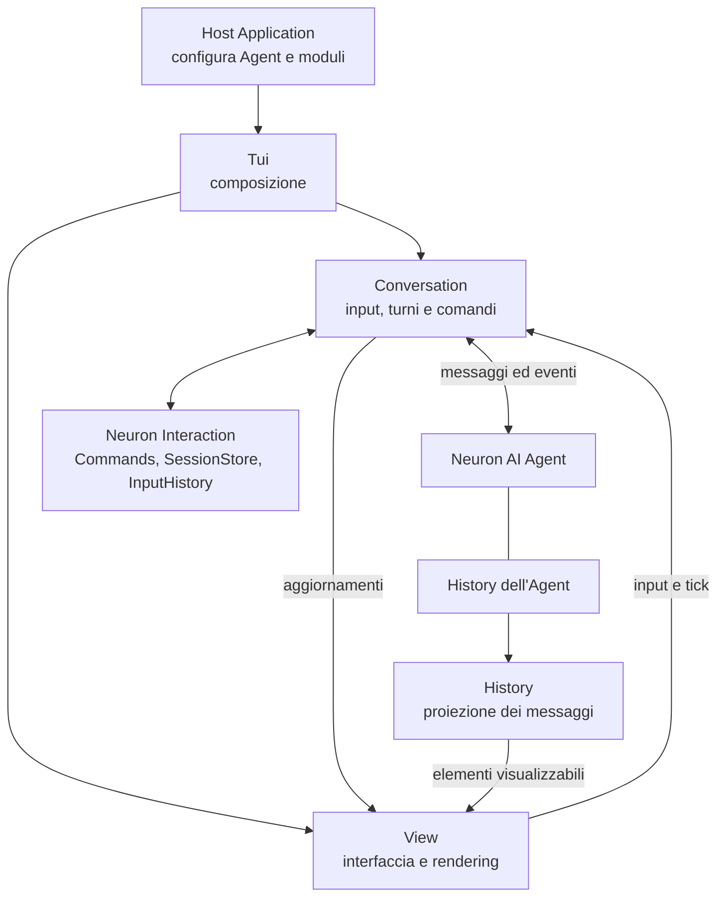

# Architettura di Neuron TUI

Neuron TUI collega un Agent Neuron AI, configurato dalla Host Application,
a un’interfaccia nel terminale basata su Symfony TUI. Neuron Interaction
fornisce Commands, SessionStore e InputHistory riutilizzabili in altri Adapter.

La documentazione segue le parti del codice:

| Documento | Contenuto |
| --- | --- |
| [Tui](Tui.md) | Punto di ingresso, dipendenze, configurazione e ciclo di vita. |
| [Conversation](Conversation.md) | Interpretazione degli input, coda, streaming, comandi e selezioni. |
| [View](View.md) | Componenti visuali, rendering, composer, Picker e indicatori. |
| [History](History.md) | Proiezione dei messaggi, correlazione dei tool e distinzione tra gli stati della conversazione. |

## Mappa generale

Le frecce rappresentano i principali scambi a runtime. La History è posseduta
dall’Agent; il modulo locale `History` ne costruisce la rappresentazione per
la vista. I documenti descrivono l’implementazione attuale.

Il vocabolario di dominio è in [CONTEXT.md](../../CONTEXT.md), gli esempi d’uso
nel [README principale](../../README.md). Gli [ADR](../adr/) conservano le
decisioni e le loro revisioni, comprese API storiche successivamente sostituite.
