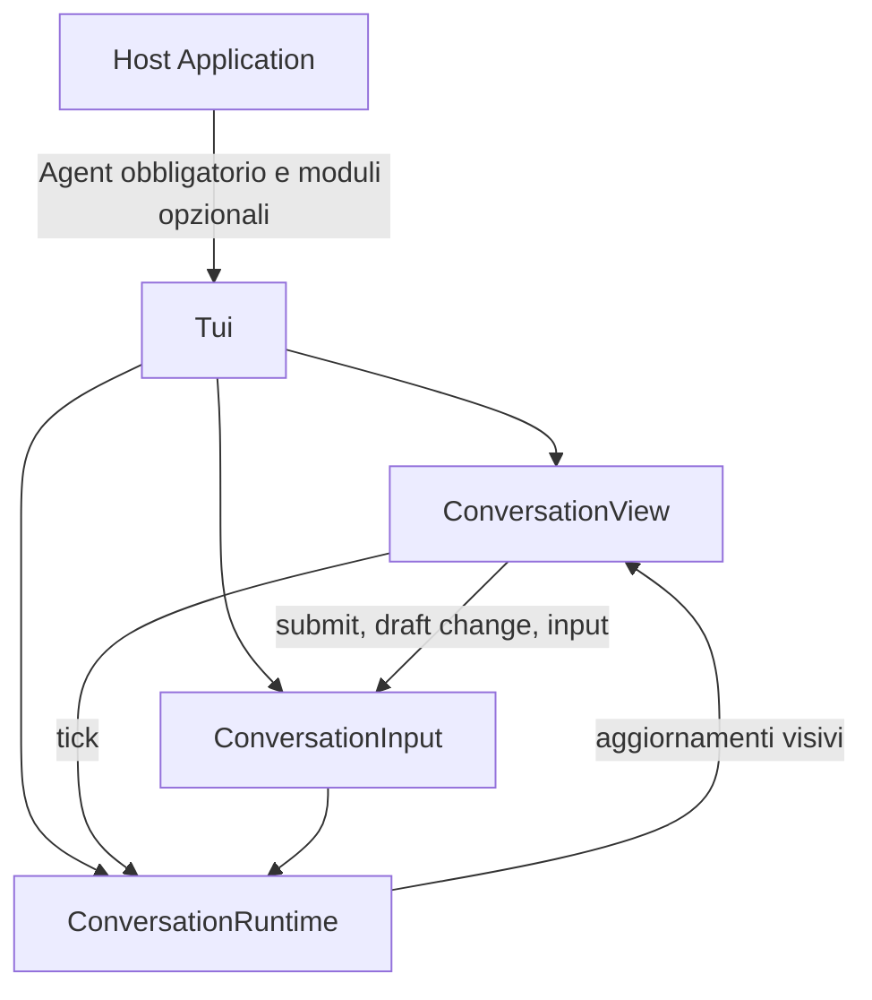

# Tui: composizione e avvio

[Indice dell’architettura](README.md)

[Tui](../../src/Tui.php) è il punto di ingresso pubblico della libreria.
La Host Application prepara l’Agent e i moduli opzionali; Tui li collega
all’interfaccia nel terminale quando viene chiamato `run()`.

## Dipendenze e configurazione

Il costruttore e la factory `make()` accettano gli stessi argomenti:

| Argomento | Ruolo | Default quando omesso |
| --- | --- | --- |
| Agent | Agent già configurato che risponde alla persona | Obbligatorio |
| TerminalInterface | Terminale usato dalla vista | Terminal di Symfony TUI |
| Commands | Comandi montati dalla Host Application | Collezione vuota |
| SessionStore | Conversazioni gestite per un utente | Store in memoria, owner `local` |
| InputHistory | Registrazione e richiamo degli input | Istanza con un proprio InMemoryStorage |

Le istanze dei moduli fornite dall’applicazione vengono riutilizzate.
SessionStore e InputHistory possono condividere Storage, ma non è richiesto.
Provider, tool e History iniziale sono configurati sull’Agent dalla Host
Application.

`setTitle()`, `setSubtitle()` e `setFiglet()` personalizzano la presentazione
prima dell’avvio. Il titolo predefinito è `Neuron AI`, il sottotitolo
`Agent conversation`; il banner FIGlet è opzionale.

## Ciclo di vita

1. La Host Application costruisce Tui e completa la configurazione.
2. `run()` marca l’istanza come avviata e risolve il Terminal.
3. Costruisce ConversationView, ConversationRuntime e ConversationInput.
4. Mostra i messaggi già presenti nella History dell’Agent.
5. Collega invii, cambi della bozza e input a ConversationInput, e tick a Runtime.
6. Verifica il TTY quando usa il Terminal concreto e avvia `ConversationView::run()`.

`run()` rimane attivo fino alla chiusura del terminale. La stessa istanza non
può essere riconfigurata tramite i setter né avviata una seconda volta.
La History resta nell’Agent; la TUI non seleziona automaticamente una Session
né importa la conversazione iniziale nello Store.

## Configurazione ed estensioni

Senza moduli espliciti, Tui crea Commands vuoto, SessionStore in memoria con
owner `local` e InputHistory con una propria istanza di InMemoryStorage.
Questi store non creano file. L'eventuale persistenza della History iniziale
dipende comunque dalla configurazione dell'Agent.

La Host Application può:

- montare i comandi desiderati, inclusi quelli personalizzati;
- fornire SessionStore e InputHistory con FileStorage, condiviso o separato;
- configurare titolo, sottotitolo e banner FIGlet prima dell'avvio;
- fornire un TerminalInterface alternativo, come quello virtuale usato nei test.

Per il coordinamento operativo vedere [Conversation](Conversation.md);
per i componenti visuali vedere [View](View.md). Gli esempi completi sono nel
[README principale](../../README.md).
