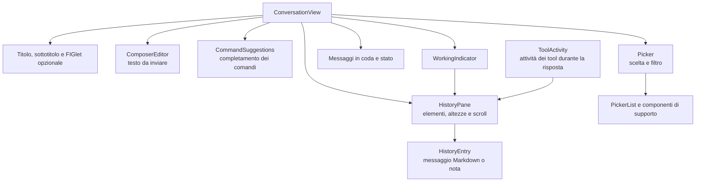

# View: stato visivo e rendering

[Indice dell’architettura](README.md)

Il modulo [src/View](../../src/View) presenta la conversazione tramite Symfony
TUI. [ConversationView](../../src/View/ConversationView.php) compone i widget,
espone callback per input e tick e offre al runtime operazioni come
`showHistory()`, `appendAgentText()`, `choose()` e `showError()`.

## Composizione visuale

Il diagramma mostra i componenti principali e le loro responsabilità, senza
riprodurre tutti i contenitori del layout.

[ConversationStyleSheet](../../src/View/ConversationStyleSheet.php) concentra
le regole di stile. [DisplayableText](../../src/View/DisplayableText.php)
fornisce la normalizzazione del testo per il terminale e le anteprime su una
sola riga.

## Due percorsi di aggiornamento

All’avvio e quando cambia Session, `showHistory()` ferma il Working indicator,
svuota HistoryPane e costruisce una HistoryProjection dai messaggi ricevuti.
Le Entry risultanti diventano messaggi o note della vista.

Durante una risposta, AgentTurn chiama `beginAgentResponse()` e riceve un
ToolActivity per il gruppo di tool del turno. I TextChunk vengono aggiunti
al messaggio dell’Agent, mentre ToolCallChunk e ToolResultChunk aggiornano
le note dei tool. `paintPendingChanges()` richiede il rendering degli
aggiornamenti già accumulati.

HistoryPane gestisce aggiunta, rimozione e modifica degli elementi insieme
alla loro altezza. HistoryEntry è l’oggetto attraverso cui si modifica un
elemento: quando il testo cambia, viene aggiornata la misura e notificato il
pannello. Questo mantiene coerente la posizione di lettura anche mentre arriva
nuovo testo. Il pannello segue gli ultimi elementi quando la persona non ha
scorso verso la parte precedente della conversazione.

## Composer, suggerimenti e Picker

| Componente | Interazione |
| --- | --- |
| ComposerEditor | Mantiene il testo da inviare e consente di ripristinare una bozza richiamata. |
| CommandSuggestions | Mostra i comandi compatibili con il nome in scrittura; frecce, Tab e Invio permettono selezione, completamento ed esecuzione. |
| Picker | Presenta una richiesta di scelta, permette di filtrare le opzioni e conclude con un valore oppure un annullamento. |

I suggerimenti operano mentre il composer conserva il focus. Il Picker prende
invece il controllo della scelta: in quel momento il testo digitato serve a
filtrare le opzioni. ConversationView usa una `DeferredFuture` per attendere
il valore scelto o l’annullamento. TuiAdapter usa poi il valore per invocare
nuovamente il comando, come descritto in [Conversation](Conversation.md).

Quando si chiude la TUI con una scelta pendente, la vista prima libera
l’attesa annullando la scelta, poi ferma il loop.

## Indicatori e attività dei tool

[WorkingIndicator](../../src/View/WorkingIndicator.php) possiede una nota
animata nella History. Runtime lo avvia all’accettazione del turno e lo fa
avanzare durante l’attesa; AgentTurn lo interrompe quando arriva testo e ne
coordina la visualizzazione durante il completamento dei tool.

[ToolActivity](../../src/View/ToolActivity.php) mantiene gli elementi visuali
associati alle chiamate e misura il tempo trascorso. Riusa ToolCorrelation e
ToolActivityText del modulo History per associare i risultati e costruire
il testo, così le regole sono condivise con la ricostruzione di una Session.

La vista mantiene una rappresentazione della conversazione; il contesto usato
dall’Agent risiede nella sua History. Questa distinzione è approfondita in
[History](History.md).
